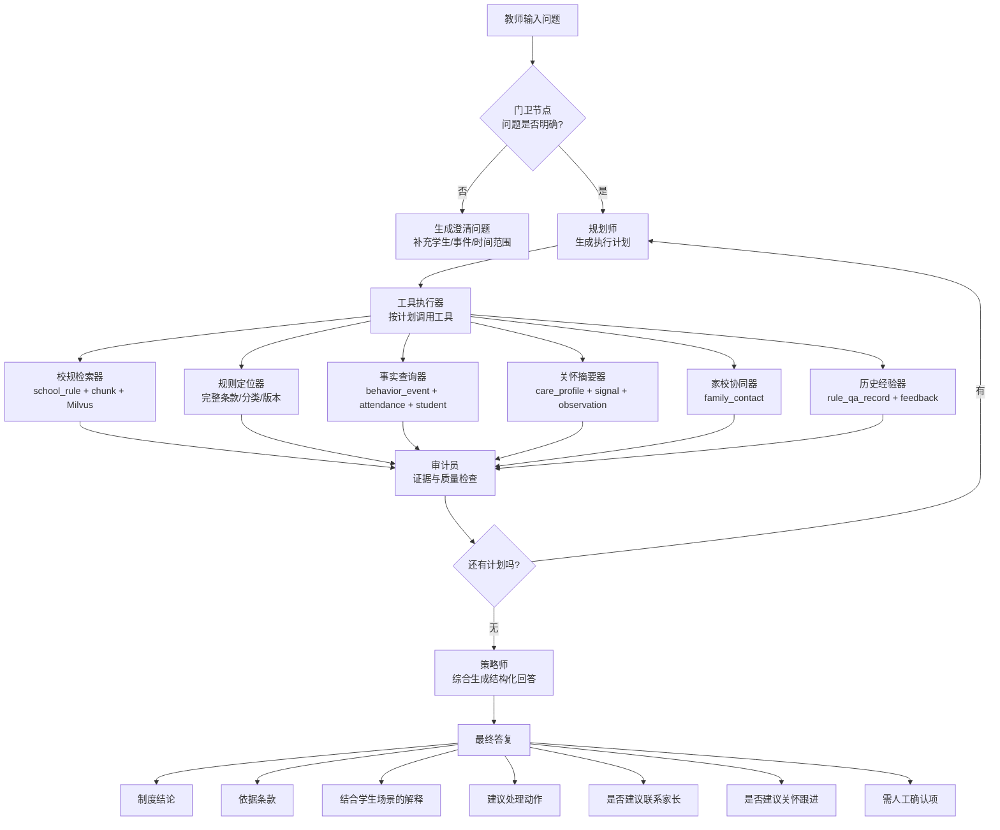

# Teacher Rule Assistant V2 Implementation Plan

**Goal:** 为教师与管理员新增“教师版校规助手 V2”，在保留学生版现有校规问答的前提下，基于校规知识库、学生行为事实、考勤记录、学生关怀摘要与家校联系记录，输出更适合教师处置场景的制度解释与建议动作。

**Architecture:** 保留现有 `rule_rag` 作为校规检索底座，在其上新增一层教师专用编排服务。编排层负责问题澄清、执行计划、工具调用、结果审计和结构化输出，确保“校规是依据，画像是辅助，人工确认是边界”。

**Tech Stack:** FastAPI, SQLAlchemy, MySQL, Milvus, Vue 3, Element Plus

---

## 1. Product Positioning

### 1.1 What This Module Is

- 教师专用的校规处置辅助工具
- 以校规条款为主依据的情境化问答系统
- 能结合学生近期行为、考勤和关怀摘要生成处理建议

### 1.2 What This Module Is Not

- 不是学生端功能升级
- 不是自动处分决策器
- 不是把学生画像直接暴露给普通问答页面
- 不是替代校方正式认定流程的裁决系统

### 1.3 Target Users

- `teacher`
- `admin`

### 1.4 Core Scenarios

- “这个学生最近三次迟到，按校规怎么理解比较合适？”
- “课堂上带手机被发现，制度依据是什么，老师下一步怎么处理？”
- “这类行为是否建议联系家长？”
- “除了校规结论外，是否建议同步转入学生关怀跟进？”

---

## 2. Functional Architecture Diagram

下面这张图对应教师版校规助手的完整链路，结构与参考图保持一致，但节点已经替换成项目内真实能力。



---

## 3. Module Mapping

### 3.1 Existing Modules We Reuse

- `backend/services/rag/rule_rag_service.py`
- `backend/services/rag/hybrid_retriever.py`
- `backend/services/rag/rule_kb_service.py`
- `backend/database/models/school_rule.py`
- `backend/database/models/school_rule_chunk.py`
- `backend/database/models/rule_qa_record.py`
- `backend/database/models/rule_qa_feedback.py`

### 3.2 New Teacher-Side Orchestration Modules

- `backend/api/teacher_rule_assistant.py`
- `backend/schemas/teacher_rule_assistant.py`
- `backend/services/rag/teacher_rule_assistant_service.py`
- `backend/services/rag/teacher_rule_tools.py`
- `backend/services/rag/teacher_rule_audit.py`

### 3.3 Frontend Modules

- `frontend/src/api/teacherRuleAssistant.js`
- `frontend/src/views/ai/TeacherRuleAssistant.vue`

---

## 4. Data Sources and Usage Boundaries

### 4.1 Primary Basis

- `school_rule`
- `school_rule_chunk`
- Milvus 检索结果

用途：
- 给出制度依据
- 引用相关条款
- 作为最终结论的唯一正式依据

### 4.2 Fact Context

- `student`
- `student_behavior_event`
- `student_attendance`

用途：
- 识别学生身份和时间上下文
- 提供“最近发生了什么”的事实摘要
- 支持老师询问“这次情况放进校规里怎么理解”

### 4.3 Care Context

- `student_care_profile`
- `student_care_signal`
- `student_care_observation`

用途：
- 只输出温和的“沟通与跟进建议”
- 不直接输出风险标签、原始分数和敏感研判细节

### 4.4 Home-School Context

- `student_family_contact`

用途：
- 提示近期是否已有家校联系
- 为“是否建议联系家长”提供上下文

### 4.5 Strict Boundaries

- 学生版继续使用现有校规问答，不接入教师增强上下文
- 教师版回答中不得把画像原始分数、敏感标签直接展示给用户
- 教师版必须明确区分“制度依据”和“辅助建议”
- 最终回答必须保留“需人工确认项”

---

## 5. Response Contract

教师版返回不应只有一段 `answer`，而是统一为结构化结果：

```json
{
  "answer": "综合回答",
  "policy_basis": [
    {
      "rule_id": 12,
      "title": "课堂纪律管理",
      "excerpt": "课堂期间不得擅自使用手机"
    }
  ],
  "student_context_summary": {
    "student_id": 1001,
    "behavior_summary": "近 30 天出现 2 次课堂手机事件、1 次迟到",
    "attendance_summary": "近 14 天有 2 次迟到",
    "care_hint": "建议以支持性沟通方式了解原因"
  },
  "recommended_actions": [
    "先向学生确认事件经过",
    "按校规进行记录并口头教育"
  ],
  "parent_contact_advice": {
    "suggested": true,
    "reason": "近期已有重复性行为，建议同步家长"
  },
  "care_followup_advice": {
    "suggested": false,
    "reason": "暂无明显持续性风险线索"
  },
  "needs_manual_confirmation": [
    "是否存在特殊请假或临时授权情形"
  ],
  "history_experience": {
    "history_summary": "相近问题历史上出现过 2 次低满意反馈",
    "history_risk_hint": true,
    "history_feedback_count": 3
  },
  "audit": {
    "passed": true,
    "issues": []
  },
  "meta": {
    "planner": [
      "检索相关校规条款",
      "带入学生基础信息与事实摘要",
      "综合生成教师侧结构化回答"
    ],
    "gatekeeper": {
      "question_clear": true,
      "reason": "sufficient"
    }
  },
  "sources": []
}
```

---

## 6. Workflow Rules

### 6.1 Gatekeeper Node

职责：
- 判断是否为校规相关问题
- 判断信息是否足够
- 判断是否涉及具体学生或事件

输出：
- `question_clear`
- `needs_student_context`
- `clarification_question`

### 6.2 Planner Node

职责：
- 将问题拆成 1 到 3 步
- 决定是否需要事实查询、关怀摘要和家校联系

典型计划：
- `rule_only`
- `rule_plus_fact`
- `rule_plus_fact_plus_care`

### 6.3 Tool Executor

工具执行顺序建议：
1. 先查校规
2. 再查学生事实
3. 再补关怀建议
4. 最后补家校联系建议

### 6.4 Auditor Node

检查项：
- 有没有制度证据
- 回答是否超出证据
- 是否混入敏感画像细节
- 是否把建议误写成正式决定
- 是否缺失人工确认提示

### 6.5 Final Composer

输出风格：
- 先结论
- 再依据
- 再结合当前场景解释
- 再给建议动作
- 最后保留人工确认项

---

## 7. MVP Scope

### 7.1 In Scope

- 教师端独立页面
- 教师专用问答接口
- 校规检索复用现有 RAG
- 行为、考勤事实摘要
- 画像温和摘要
- 家校联系建议
- 审计与敏感信息过滤
- 规划过程与历史经验展示

### 7.2 Out of Scope

- 学生端升级
- 自动处分决定
- 图数据库增强
- 自学习调优
- 复杂多代理并行执行

---

## 8. Implementation Phases

### Phase 1: Skeleton and Contract

**Status:** Completed

**Goal:** 先把教师专用入口、响应结构和基础编排跑通。

**Files:**
- Create: `backend/api/teacher_rule_assistant.py`
- Create: `backend/schemas/teacher_rule_assistant.py`
- Create: `backend/services/rag/teacher_rule_assistant_service.py`
- Modify: `backend/main.py`
- Create: `frontend/src/api/teacherRuleAssistant.js`

**Acceptance:**
- 教师账号可调用
- 学生账号被拒绝
- 纯校规问题可正常回答

### Phase 2: Fact Tools

**Status:** Completed

**Goal:** 接入行为事件、考勤和学生基础信息，形成教师视角的事实摘要。

**Files:**
- Create: `backend/services/rag/teacher_rule_tools.py`
- Modify: `backend/services/rag/teacher_rule_assistant_service.py`
- Modify: `backend/tests/test_teacher_rule_assistant.py`

**Acceptance:**
- 带 `student_id` 的问题会汇总学生行为和考勤事实
- 教师只能查看自己班级学生
- 管理员可跨班使用

### Phase 3: Care and Home-School Context

**Status:** Completed

**Goal:** 接入学生关怀摘要与家校联系记录，输出更稳妥的支持性建议。

**Files:**
- Modify: `backend/services/rag/teacher_rule_tools.py`
- Modify: `backend/services/rag/teacher_rule_assistant_service.py`
- Modify: `backend/tests/test_teacher_rule_assistant.py`

**Acceptance:**
- 返回 `care_followup_advice`
- 返回 `parent_contact_advice`
- 不暴露敏感风险标签或原始评分

### Phase 4: Audit and Teacher UI

**Status:** Completed

**Goal:** 增加结果审计、教师专用页面和学生选择器，让链路可用且可演示。

**Files:**
- Create: `backend/services/rag/teacher_rule_audit.py`
- Modify: `backend/services/rag/teacher_rule_assistant_service.py`
- Create: `frontend/src/views/ai/TeacherRuleAssistant.vue`
- Modify: `frontend/src/router/routes.js`

**Acceptance:**
- 页面可访问
- 支持搜索选择学生
- 展示制度依据、学生上下文、建议动作、来源和审计结果

### Phase 5: Planner and Experience Layer

**Status:** Completed

**Goal:** 把“规划师”和“历史经验器”补齐，让页面可解释、结果更稳。

**Files:**
- Modify: `backend/services/rag/teacher_rule_assistant_service.py`
- Modify: `backend/services/rag/teacher_rule_tools.py`
- Modify: `frontend/src/views/ai/TeacherRuleAssistant.vue`
- Modify: `backend/tests/test_teacher_rule_assistant.py`

**Acceptance:**
- 返回 `meta.planner`
- 返回 `history_experience`
- 前端展示执行计划和历史经验摘要

### Phase 6: Clarification UX and Delivery Tracking

**Status:** In Progress

**Goal:** 让澄清问题、门卫判断和实施状态在页面与文档上都更清晰，方便演示和后续迭代跟踪。

**Files:**
- Modify: `frontend/src/views/ai/TeacherRuleAssistant.vue`
- Modify: `docs/plans/2026-04-11-teacher-rule-assistant-v2.md`

**Acceptance:**
- 页面区分“正式分析结果”和“待补充澄清”
- 页面可见门卫节点状态
- 文档中能直接查看阶段状态和下一步任务

---

## 9. Current Progress Snapshot

### 9.1 Implemented

- 教师专用 API 已上线
- 教师和管理员权限控制已生效
- 门卫节点已能对模糊问题返回澄清
- 规划层已能区分规则型、规则加事实型、规则加关怀型路径
- 行为、考勤、关怀、家校联系与历史经验已接入
- 审计层已能做基础证据与脱敏检查
- 教师页已可搜索学生、提交问题、查看结构化结果
- 教师页已重做为“结论优先，细节折叠”的信息层级
- 教师端返回已新增 `decision_summary`，用于直接展示结论、动作、家校联系与关怀跟进判断
- 高频测试校规已升级为结构化正文，并通过检索加权参与召回

### 9.2 Current Gaps

- 正式校规库仍偏少，当前高质量结构化规则主要集中在测试种子
- 结构化规则目前复用 `content + keywords_json`，尚未独立成专门元数据表
- 教师结论摘要已可用，但还可以进一步收敛成更短的“处置口径”

---

## 10. Next Action Checklist

- [x] 新增教师版后端入口与响应契约
- [x] 接入行为、考勤事实摘要
- [x] 接入关怀摘要与家校联系建议
- [x] 增加审计层与老师专用页面
- [x] 接入规划层与历史经验器
- [x] 新增可软插入、可清理的测试校规种子脚本
- [x] 优化教师页信息层级，默认只展示结论、动作、联系家长和关怀跟进
- [x] 补高频主题的结构化测试校规，并将结构化信号接入检索权重
- [ ] 补充端到端演示用例与截图
- [ ] 根据真实试用反馈微调 planner 规则

---

## 11. Test Rule Seeding

为了让教师版校规助手后续测试更稳定，已补充一份专用测试校规脚本：

- `backend/scripts/seed_teacher_rule_test_rules.py`

设计原则：

- 使用固定标题前缀 `"[TEST_RULE_SEED]"`
- 在正文首行加入固定标记 `test_rule_seed_v1`
- 只 upsert 这批测试规则，不影响正式校规
- 每条插入或更新后自动重建对应 RAG 索引
- 支持一键清理这批测试规则并删除对应索引

使用方式：

```bash
python backend/scripts/seed_teacher_rule_test_rules.py
python backend/scripts/seed_teacher_rule_test_rules.py --cleanup
```

当前补充的测试主题包括：

- 迟到管理
- 早退与旷课管理
- 课堂迟到与课堂纪律
- 手机与智能终端管理
- 同伴冲突与欺凌苗头处置
- 家校联系的一般原则
- 需要持续关怀跟进的情形
- 病假、事假与补假说明

---

## 12. Completion Criteria

当满足以下条件时，本轮教师版校规助手 V2 可视为达到首个稳定可演示版本：

- 教师能够在独立页面完成提问
- 模糊问题会先澄清，不会直接给出不稳妥判断
- 个案问题能结合校规、事实、关怀和家校联系给出结构化建议
- 回答中保留制度依据、建议动作和人工确认边界
- 敏感画像信息不会被直接暴露
- 页面可展示来源、执行计划、历史经验与审计结果
